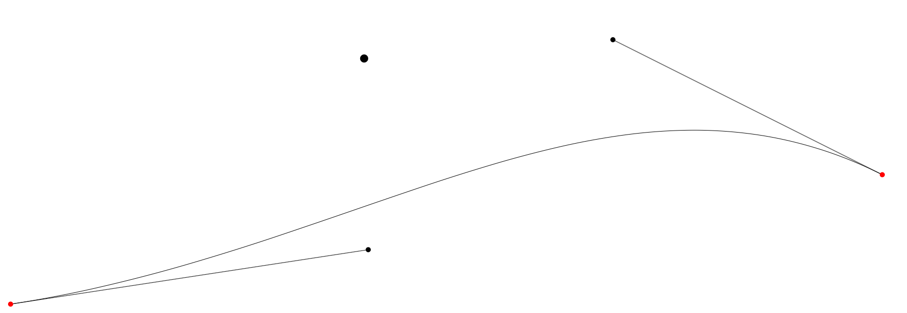

# canvas-pellet-collision-demo

最近实现的 canvas 动画小 demo，拖拽小球，自由落体，碰撞反弹，没有任何插件引入。

A recently implemented canvas animation demo featuring a draggable ball, free-fall motion, collision rebound, all achieved without any external plugins.

> 鼠标拖动黑色小球，鼠标松开后小球自由落体并弹跳。
> 
> Drag the black ball with the mouse, and upon releasing the mouse button, the ball undergoes free fall and bounces back.

**demo 地址**：https://xiaowuqiqi.github.io/canvas-pellet-collision

